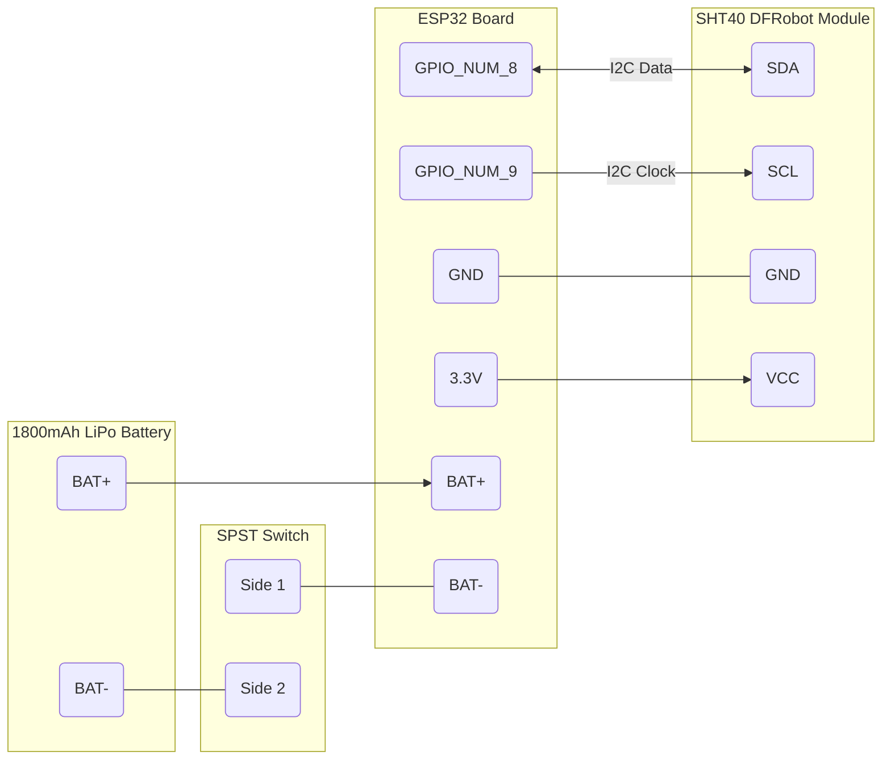

# VeloClimat_ESP32_Firmware

Get data from a sht40 I2C sensor and transmits it over BLE
<br></br>

# Dependencies 

- ESP-IDF
<br></br>

# Build

Clone the repository :  
```bash
git clone https://github.com/The-Last-Resort-FR/VeloClimat_ESP32_Firmware.git
```

Build the app
```bash
get_idf # or make sure you have the idf environement loaded in your terminal
cd VeloClimat_ESP32_Firmware
idf.py build
```

Flash the app on the ESP32
```bash
idf.py flash monitor
```
<br></br>

# Additional Infos

- Set the target for your esp32 model (example `idf.py set_target esp32-c3`)  
- Make sure you have the flash size of your particular esp32 set right (`idf.py menuconfig`)
- Make sure you have the I2C pins set right `GPIO_SDA_PIN` and  `GPIO_SCL_PIN` defines in the gatts_server.c  
- You can choose the accuracy level you want by changing the line `uint8_t command[1] = {SHT40_MEDIUM_ACCURACY_MEASURMENT_COMMAND};` in `sht_get_data`
- As it stands a 1800mAh battery should last about 26hrs  

<br></br>

# Tested hardware

- ESP32-WROOM-32E
- ESP32-C3 (devkit-lipo)
- SHT40 (DFRobot module v1)

<br></br>

# Pinout

ESP32 GPIO_NUM_8 -> SHT40 SDA  
ESP32 GPIO_NUM_9 -> SHT40 SCL  
ESP32 GND        -> SHT40 GND  
ESP32 3.3V       -> SHT40 VCC  

ESP32 BAT-       -> Switch side 1  
Switch side 2    -> BAT-  
BAT+             -> ESP32 BAT+  

# Diagram



# Tips

- You can soften the switch hole with a heat gun or a hot air station before inserting it
- The battery is taped to the back with a piece of nano tape
- The battery connector on the ESP32 can be desoldered to solder the wires through the vias
- The rest is soldered on headers and covered with heat shrink tube